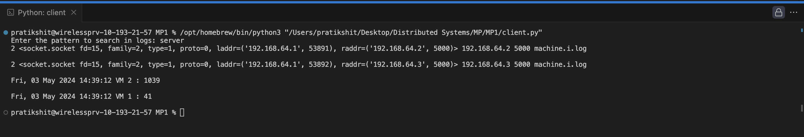

# CS425 MP1
## Distributed Logging System

## Instructions
* The server code can be run on all the VMs, with making the DNS fetching be `socket.gethostname()`. This is in server.py. There is also client.py. This can be used in any of the VM to make it act like querier machine. 

* To run the code, run server.py on the corresponding machines. After server.py is running on all machines, run client.py on any of the machines. The machine where client.py runs is the querying machine. 

#### The testcases for these can be written by utilizing unittest testing framework with MagicMocks in python.

